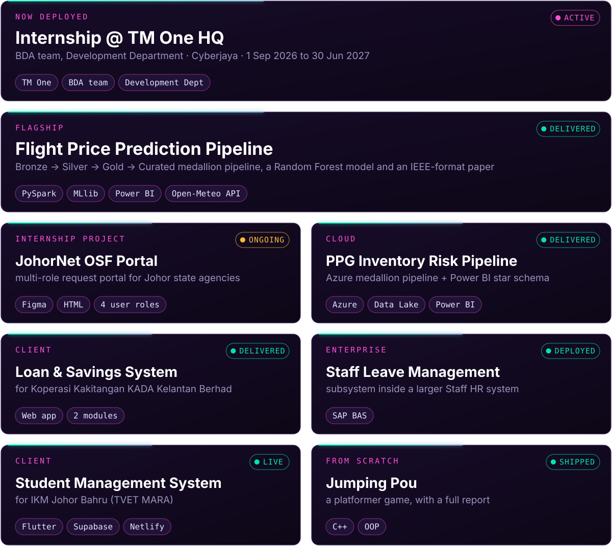
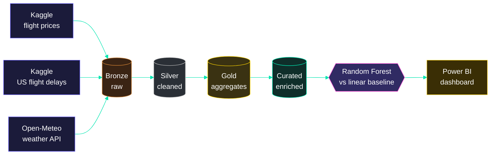

Hi, I'm Bella. My favourite part of any project is the messy middle, when the data is all over the place and nobody's sure yet what shape it should be in.

Two moments that taught me the most so far:

- A web scraper whose HTML parser broke on a live site. The fix wasn't more parsing code, it was finding the internal API the site was already using.
- A loan & savings system for Koperasi KADA Kelantan. Splitting loans and savings into two separate modules made each one easier to test, and easier for the client to trust.

Most of what I build comes back to one question: *how much structure does this data actually need?*

<b>⟢ peek inside the flight price pipeline</b> (click to expand)

 

**Universiti Teknologi Malaysia (UTM)** 
Bachelor of Computer Science (Data Engineering) with Honours 
`YEAR 4` `CGPA 3.39`

<b>⟢ certifications unlocked</b> (5)

 

- [x] Microsoft Certified: Azure Data Fundamentals (AZ-900)
- [x] Alteryx Designer Core
- [x] AWS Academy Cloud Foundations
- [x] AWS Academy Cloud Developing
- [x] AWS Academy Lab Project: Cloud Data Pipeline Builder

  

still learning, still breaking things, still fixing them.

