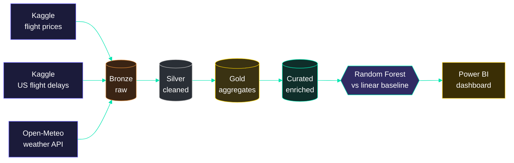

<div align="center">


<a href="https://bellaazharr.github.io/">
  
</a>

<br/>

[](https://bellaazharr.github.io/)
[](https://www.linkedin.com/in/ain-nurnabila-39885529a/)
[](mailto:bellaaazharr28@gmail.com)


</div>

```text
> booting bella.exe ...

[ ok ] loading coffee ........................ done
[ ok ] mounting spark cluster ................ done
[ ok ] loading certifications (5) ............ done
[ ok ] location ............................... selangor, malaysia
[ >> ] degree progress ....................... ███████████████████░  year 4 / 4
[ >> ] flight price pipeline ................. running
[ ?? ] next mission .......................... your team, maybe?
```


### `~/about-me`

Hi, I'm Bella. I'm a final-year Computer Science student at UTM, majoring in Data Engineering. My favourite part of any project is the messy middle, when the data is all over the place and nobody's sure yet what shape it should be in.

Two moments that taught me the most so far:

- A web scraper whose HTML parser broke on a live site. The fix wasn't more parsing code, it was finding the internal API the site was already using.
- A loan & savings system for Koperasi KADA Kelantan. Splitting loans and savings into two separate modules made each one easier to test, and easier for the client to trust.

Most of what I build comes back to one question: *how much structure does this data actually need?*

### `~/mission-log`

| mission | stack | status |
|---|---|---|
| **Flight Price Prediction Pipeline**<br/><sub>Spark medallion pipeline + IEEE-format paper, under lecturer supervision</sub> | PySpark · MLlib · Power BI | `🟡 in progress` |
| **Loan & Savings System**<br/><sub>for Koperasi Kakitangan KADA Kelantan Berhad, with Lembaga Kemajuan Pertanian Kemubu (KADA)</sub> | Web app | `🟢 delivered` |
| **Staff Leave Management Subsystem**<br/><sub>part of a larger Staff HR system, fully documented</sub> | SAP Business Application Studio | `🟢 deployed` |
| **Student Management System**<br/><sub>for IKM Johor Bahru (TVET MARA): registration + timetable upload</sub> | Flutter · Supabase · Netlify | `🟢 live` |
| **Jumping Pou**<br/><sub>a platformer game written from scratch, with full report</sub> | C++ | `✅ shipped` |

<details>
<summary><b>▸ peek inside the flight price pipeline</b> <sub>(click to expand)</sub></summary>

<br/>



</details>

### `~/toolkit`

<div align="center">


<br/><br/>


</div>

### `~/education`

**Universiti Teknologi Malaysia (UTM)**
Bachelor of Computer Science (Data Engineering) with Honours
`Year 4` · `CGPA 3.39`

<sub>Coursework I've enjoyed: Data Engineering, Business Intelligence, Cloud Computing, High Performance Data Processing</sub>

### `~/certifications-unlocked`

- [x] Microsoft Certified: Azure Data Fundamentals (AZ-900)
- [x] Alteryx Designer Core
- [x] AWS Academy Cloud Foundations
- [x] AWS Academy Cloud Developing
- [x] AWS Academy Lab Project: Cloud Data Pipeline Builder

### `~/e-portfolio`

Everything in one place, with projects, coursework and reflections sorted by semester.

**[→ enter bellaazharr.github.io](https://bellaazharr.github.io/)** · <sub>[academic record repo](https://github.com/bellaazharr/eportfolio-SECP3843)</sub>


### `~/telemetry`

<div align="center">


<br/>

<sub>still learning, still breaking things, still fixing them.</sub>


</div>
